# VR Builder Manual

## Table of Contents

1. [Introduction](#introduction)
1. [Requirements](#requirements)
1. [Installation](#installation)
1. [Quick Start](#quick-start)
    - [Demo Scene Overview](#demo-scene-overview)
    - [Demo Scene Hierarchy](#demo-scene-hierarchy)
    - [Process Editor](#process-editor)
        - [Chapters View](#chapters-view)
        - [Graph View](#graph-view)
        - [Step Nodes](#step-nodes)
1. [Process Scene Objects](#process-scene-objects)
1. [Default Behaviors](#default-behaviors)
    - [Play Audio File](#guidanceplay-audio-file)
    - [Play TextToSpeech Audio](#guidanceplay-texttospeech-audio)
    - [Highlight Object](#guidancehighlight-object)
    - [Audio Hint](#guidanceaudio-hint)
    - [Spawn Confetti](#guidancespawn-confetti)
    - [Behavior Sequence](#utilitybehavior-sequence)
    - [Delay](#utilitydelay)
    - [Set Parent](#utilityset-parent)
    - [Disable Object (Reference)](#environmentdisable-object-by-reference)
    - [Enable Object (Reference)](#environmentenable-object-by-reference)
    - [Disable Object (Tag)](#environmentdisable-object-by-tag)
    - [Enable Object (Tag)](#environmentenable-object-by-tag)
    - [Disable Component (Reference)](#environmentdisable-component-by-reference)
    - [Enable Component (Reference)](#environmentenable-component-by-reference)
    - [Disable Component (Tag)](#environmentdisable-component-by-tag)
    - [Enable Component (Tag)](#environmentenable-component-by-tag)
    - [Unsnap Object](#environmentunsnap-object)
    - [Move Object](#animationmove-object)
1. [Default Conditions](#default-conditions)
    - [Move Object into Collider](#environmentmove-object-in-collider)
    - [Object Nearby](#environmentobject-nearby)
    - [Grab Object (Reference)](#interactiongrab-object-by-reference)
    - [Grab Object (Tag)](#interactiongrab-object-by-tag)
    - [Release Object](#interactionrelease-object)
    - [Snap Object](#interactionsnap-object)
    - [Touch Object](#interactiontouch-object)
    - [Use Object](#interactionuse-object)
    - [Timeout](#utilitytimeout)
    - [Teleport](#vr-userteleport)
1. [Online Documentation](#online-documentation)
1. [Acknowledgements](#acknowledgements)
1. [Contact and Support](#contact-and-support)

## Introduction

VR Builder helps you create interactive VR applications better and faster. By setting up a Unity scene for VR Builder, you will pair it with a VR Builder *process*. Through the VR Builder process, you can define a sequence of actions the user can take in the scene and the resulting consequences.

You can easily edit a process without coding through VR Builder's process editor. The process editor is a node editor where the user can arrange and connect the *steps* of the process. Each step is a different node and can include any number of *behaviors*, which make things happen in the scene. Likewise, a step will have at least one *transition* leading to another step. Every transition can list several *conditions* which have to be completed for the transition to trigger. For example, step B can be reached only after the user has grabbed the object specified in step A.

Behaviors and conditions are the "building blocks" of VR Builder. Several of them are provided in the free version already. Additional behaviors and conditions are available in our paid add-ons. Since VR Builder is open source, you can always write your own behaviors and conditions as well.

Behaviors and conditions can interact only with *process scene objects*. These are game objects in the scene which have a `Process Scene Object` component on them.

The interaction capabilities of a process scene object can be increased by adding *scene object properties* to it. For example, adding a `Grabbable Property` component to a game object will let VR Builder know that the object is grabbable, and when it is grabbed.

Normally it is not necessary to add properties manually to an object. When an object is dragged in the inspector of a condition or behavior, the user has the option to automatically configure it with a single click.

Where possible, properties try to add and configure required components by themselves. If you add a `Grabbable Property` to a game object, this will automatically be made grabbable in VR (it still needs to have a collider and a mesh, of course).

This makes it very easy to start from some generic assets and build a fully interactive scene.

## Requirements

VR Builder is supported on Unity 2020.3 or later. It uses the built-in render pipeline by default, but URP is supported as well and existing materials can be easily converted.

VR Builder works out of the box with any headset compatible with Unity's XR Interaction Toolkit.

## Installation

You can get VR Builder from the [Unity Asset Store](https://assetstore.unity.com/packages/tools/visual-scripting/vr-builder-201913) or from our [GitHub](https://github.com/MindPort-GmbH/VR-Builder/releases). In the first case, you will be able to download and import the VR Builder package from the package manager. If you have downloaded a .unitypackage from GitHub, just import it in the project.

If you are creating a new project, select the `3D`or `3D (URP)` template. Note that it is not necessary to choose the `VR` template as VR Builder will configure the project for VR automatically.

After importing, VR Builder will compile and import some dependencies. If Unity's new input system is not selected in the player settings, the following window will appear prompting the user to automatically switch.

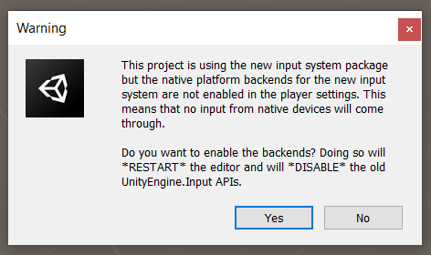

Click `Yes` in order to restart the editor and enable the new input system. Note that the new input system is required by VR Builder, but you can enable both the new and the legacy one if it makes sense for you to do so.

Then a dialog appears from Unity's XR Interaction Component.

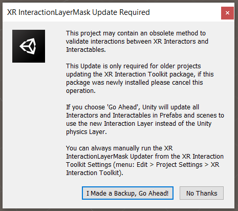

VR Builder should work with either choice, so select the option that better suits your existing project, or just go ahead if starting from a blank project.

After the automated restart, the New Process Wizard pops up.

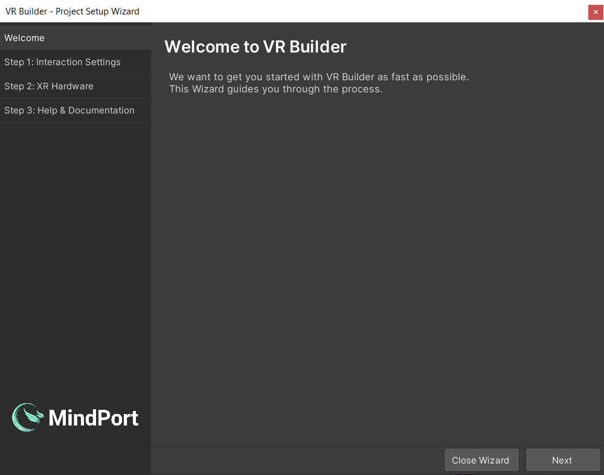

Click `Next` to proceed to the interaction settings page setup page.

Here you can configure some default settings related to VR Builder interactions. Right now, the only available setting will determine whether a newly created grabbable object will use physics or not.

You can also change these options at any time in `Project Settings > VR Builder > Settings`.

After reviewing the settings, click `Next`.

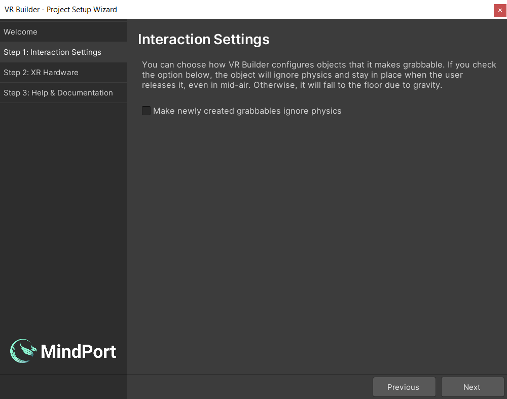

Finally, if it's not configured already, you will be able to configure your project to work with your VR hardware.
Select one of the provided options to install the relevant packages from the Package Manager.

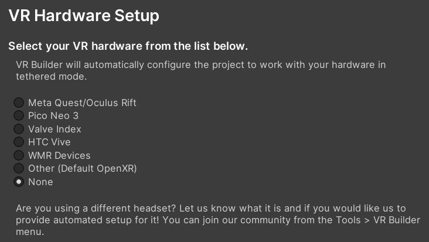

Now the setup is complete and VR Builder is ready to use!

If you chose the URP template, the materials on the avatar hands and demo scene will look solid magenta. That's Unity's way to tell you that the materials are not compatible with the current render pipeline. You can rectify this by selecting all materials (by filtering them in the project window), then click `Edit > Rendering > Materials > Convert Selected Built-in Materials to URP`. You can of course ignore this step if you don't plan to use the provided hand models or the demo scene.

## Quick Start

You can get a first impression of VR Builder and its features by accessing  the provided demo scene. This sample scene contains a pre-built process that showcases some of the interactions provided in VR Builder.

You can automatically open the demo scene at the end of the setup wizard, or use the shortcut in `Tools > VR Builder > Demo Scenes > Core`. Note that, while the scene can be found and opened from disk, it is necessary to use one of the above methods at least once in order to automatically copy the process file to the StreamingAssets folder, where VR Builder processes are saved.

### Demo Scene Overview

The demo scene showcases how to assemble a process with the building blocks included in VR Builder. More building blocks and features are available as separate add-ons.

These building blocks are either conditions or behaviors. Conditions check if the user or the world is in a certain state, and behaviors modify the world state when activated.

The process in the demo scene is linear, and will guide the user through different steps. To try out the demo scene, ensure audio volume is up, or you won't be able to hear the spoken instructions!

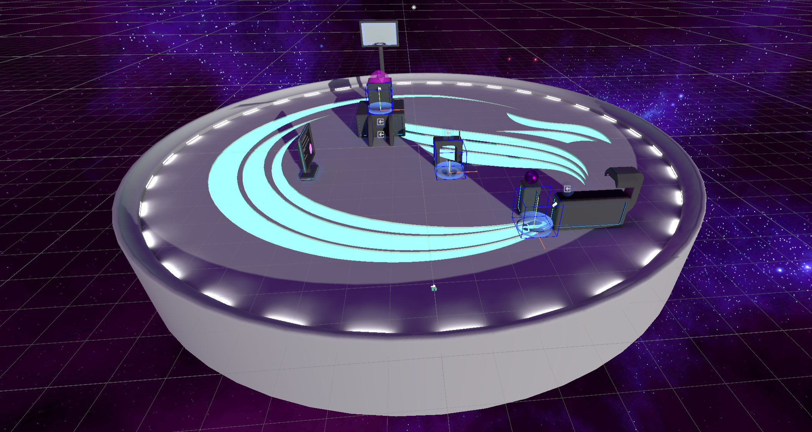

### Demo Scene Hierarchy

In the hierarchy there are three game objects in parentheses.

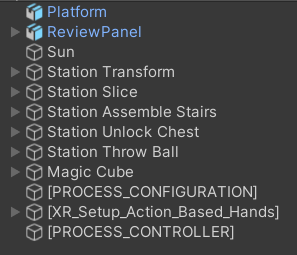

They are automatically added to every VR Builder scene.

- `[PROCESS_CONFIGURATION]` allows to select the process for the current scene from a list of processes saved in the project.
- `[PROCESS_CONTROLLER]` defines some parameters for processes in this scene like the spectator input bindings and camera.
- `[XR_Setup_Action_Based_Hands]` is the VR rig used by the default XR interaction component. If you are using a different interaction component, for example to use VR Builder in conjunction with [Interhaptics or VRIF](https://www.mindport.co/vr-builder/add-ons-integrations), you might see a different rig here.

By looking at the other objects in the scene, we can see that some have a `Process Scene Object` component and possibly some "property" component. A `Process Scene Object` is an object with a unique name that can be accessed by the process. Properties define how the process can interact with the object. For example, a `Grabbable Property` will let VR Builder recognize if an object is being grabbed. Adding a `Grabbable Property` to an object will automatically make it a `Process Scene Object` and add a few components so you can interact with the object in VR.

If these properties are not added manually you will usually be prompted to add them automatically when building the process of your VR application.

### Customizing the Rig

Since VR Builder 2.2.0, the rig system has been simplified by removing the `[INTERACTION_RIG_LOADER]` and dummy rig. The default rig is created directly in the scene and can be edited or replaced like any game object. If you plan to use the same rig in multiple scenes, just create a prefab of it and manually replace the default rig.

The only requirement every VR Builder rig has, independent of the interaction system, is that it must contain a `User Scene Object` component. This component identifies the rig as the user, and is usually placed on the head (the main camera).

It is also possible to add other `Process Scene Object`s on the rig in order to use hands, backpacks, toolbelts and so on in behaviors and conditions, depending on the use case.

### Process Editor

The process editor lets you design the  process of your VR application. You can open the process editor from `Tools > VR Builder > Open Process Editor` or `Window > VR Builder > Process Editor`. The process editor for the demo scene should look like this.

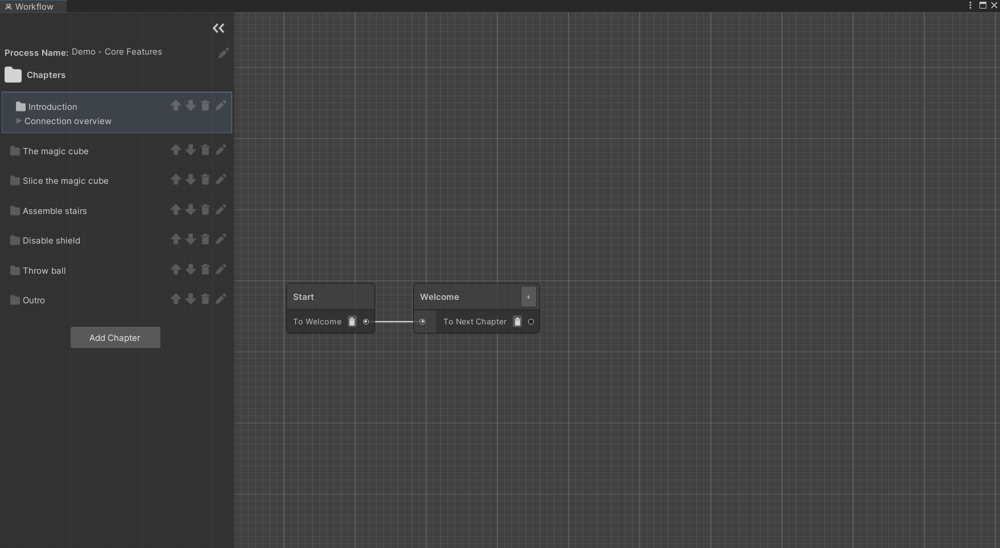

#### Chapters view
On the left, there is a list of chapters. Every chapter is a separate section of the process. They are useful to separate a process in its logical steps and avoid too much clutter in a single graph. 

You can click on the different chapters to visualize the corresponding graphs.

Next to the chapter name, there are icons that allow you to move the chapter up and down in the list, rename it or delete it.

Underneath, you can see the `Connections breakdown` foldout. Expand it to see incoming and outgoing connections for the current chapter. That is, which chapters lead here and to which chapter it is possible to go from this one. The number next to each connection represents the amount of steps that connect to the chapter. When "Next Chapter" or "Previous Chapter" is listed as a connection, it means the connection is implicit: a path ends with an empty transition, which by default ends the current chapter and starts the next one in order.

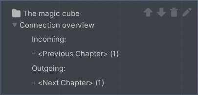

The demo scene is linear, meaning that each chapter will lead directly to the next and the connection overview only contains implicit connections, but it is possible to create more complex processes that don't follow the chapter list linearly.

#### Graph view
On the right, there is a graphical representation of the current chapter. Every node is called a `Step`. Every step can include a number of `Behaviors` which can happen when the node is triggered or before leaving it. In the demo scene, those are mostly text to speech instructions. A step can have as many exit points, called `Transitions`, as needed. Every transition can list a number of `Conditions` which, if fulfilled, make the transition valid.

Select the "Welcome" node in the first chapter. This will open the Step Inspector. The window should look like the following.

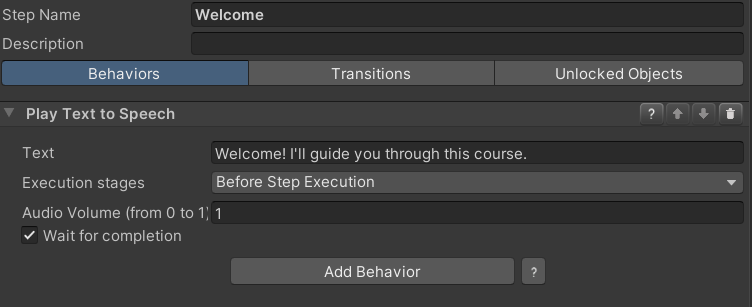

The only behavior is a text to speech instruction that will be triggered when the node is entered. Click on the "Transitions" tab.

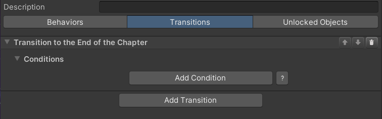

There is a single transition. A step can have multiple transitions, each leading to a different step. In this case, the transition is connected to no other step, so it will end the chapter. The next chapter, "The magic cube", will then start.

Transitions can include conditions. If they do, they will trigger only when the attached conditions are completed. This transition has no conditions, so it will trigger immediately after the current step has ended, without any input from the user.

We encourage you to investigate the other nodes to understand how the demo scene is built.

#### Step Nodes
You can create a node by right clicking anywhere in the graph and selecting `New`, then the type of node you want to create. There are two types of node available in VR Builder core:

**Step**

This is the default step node, the main building block for your process. By default, it is empty. This means that nothing will happen, and the execution will immediately proceed to the next node, if present. You will need to add behaviors and conditions to it in the `Step Inspector` in order to customize it and build your process logic.

**Step Group**

This node doesn't let you set conditions and behaviors, but instead can be expanded in a new node graph. It can be populated with other step nodes and act as a "sub-chapter" with some self contained logic. This can help keeping the process tidy.

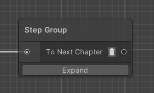

You can access the node's graph by clicking the `Expand` button or double clicking on the node itself. There are also context menu options for expanding the node or ungrouping it - that is, replacing it in the main graph with the logic it contains.

This node only has one entry and one exit point. This means that after the contained logic has ended executing, the process will always continue executing from the exit transition of the group node.

If you are in a step group graph, it will be indicated on the top left of the process editor.

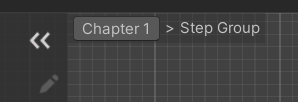

You can click on a parent to return to it. For example, clicking on "Chapter 1" will get you back to the main chapter graph.

You can also create a group by selecting a sequence of nodes, right clicking and selecting `Make group`. Since the step group node only has one input and one output, this works best when selecting linked nodes only. Edge cases are resolved as follows:
- If there are two or more inbound connections in the group, all will lead to the group's input. The first valid node will be chosen as starting step for the group, while the others will have their connection severed.
- All outgoing connections will be deleted, meaning that the process will continue from the output of the group node after the group has processed. This means that if the selected nodes lead to multiple other nodes, now they will all go through the group's output.
- The step group output will be connected to the previous target of the first valid grouped node. Other external targets in grouped nodes are ignored, which means that when the group ends it will always go to the same following node.

If you encounter one of these edge case, make sure to review your process logic after grouping, as it may have changed.

    Note: There is no theoretical limit to nesting step groups within one another. However, due to how processes are currently stored, too many nested groups can result in an unreadable JSON file. Therefore, creating step groups within a step group is currently disabled. While there are ways to work around this (e.g. with copy/paste), it is not recommended to do so.

**End Chapter**

You can use this node as the last node on a sequence. It will end the current chapter and start a new specified chapter, which can be selected from a drop-down list. This is useful to move through the chapters in a non-linear fashion. Note that you are not required to use this node for linear processes, as a chapter will automatically end when an empty transition is reached. In that case, the process will simply proceed to the following chapter.

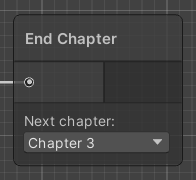

    Note: It is not recommended to use this node inside a step group as it will behave slightly differently (the nodes following the step group will be fast-forwarded before ending the chapter). It is currently not possible to create this node inside a step group.

## Process Scene Objects

The `Process Scene Object` component acts as a bridge between the VR Builder process and a Unity game object. If the process needs to observe or interact with a game object, it does so through this component. This means that every game object referenced in the process is required to have this component. If a more detailed interaction is needed, property components can be added to provide VR Builder more control on the object. For example, adding a `Grabbable Property` component will make the object grabbable, and VR Builder will be able to check if the object has been grabbed.

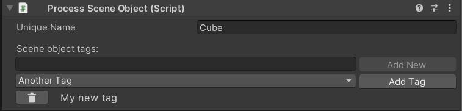

The `Process Scene Object` generates a unique name which identifies the object internally in the VR Builder process. This is usually the game object's name, but numbers can be appended to maintain uniqueness. You can customize the unique name in the appropriate field.

In addition to the unique name, it is possible to associate an arbitrary number of tags to every scene object. Tags are used by certain behaviors and conditions which allow to interact with unspecified objects with a certain tag rather than an object with a specific unique name.

You can select and add an existing tag from the list, or create and add directly a new tag. You can remove a tag from an object by clicking the recycle bin button next to it. Tags are stored on a per-project basis and can be created, edited or deleted from `Project Settings > VR Builder > Scene Object Tags`.

It is possible to edit multiple Process Scene Objects at the same time. The `Unique Name` field will of course be unavailable, but you can add or remove tags in bulk. When multiple objects are selected, all tags on all objects are listed below. 

If a tag is present only on some of the selected objects, it will be displayed in *italics*. A default text style means that the tag is present on all selected objects.

## Default Behaviors

Behaviors are used to make something happen in the process. Behaviors can be as simple as giving instructions and hints, making new objects visible, or animating an object in the scene. What they have in common is that something happens without requiring an intervention by the user.
This section lists the default behaviors included in this package.

------

## Guidance/Play Audio File

### Description

The Play Audio File behavior plays an audio clip loaded from the `Resources` folder in your project’s asset folder. VR Builder supports all audio file formats supported by Unity, which are:

- aif
- wav
- mp3
- ogg

### Configuration

- **Resources path**

    Relative file path from the Resources folder. Omit the file extension (see example).

    #### Example
     
    File to be played: `Assets/.../Resources/Sounds/click-sound.ogg`  
    Default resource path: `Sounds/click-sound`  

- **Execution stages**

    By default, steps execute behaviors in the beginning, in their activation stage. This can be changed with the `Execution stages` dropdown menu:

    - `Before Step Execution`: The step invokes the behavior during its activation.
    - `After Step Execution`: Once a transition to another step has been selected and the current step starts deactivating, the behavior is invoked.
    - `Before and After Step Execution`: Execution at activation and deactivation of a step.

- **Wait for completion**

    By default, the step waits for the audio file to finish. If you want the step to interrupt the audio in case the step is completed, uncheck this option. 
    
    Note: this might lead to an audio file not even being started.

------

## Guidance/Play TextToSpeech Audio

### Description

The Play TextToSpeech Audio behavior uses a synthesized voice to read text.

### Configuration

The default Text-to-Speech language is set to ‘English’. Check out our online [tutorial](https://www.mindport.co/vr-builder-learning-path/how-to-add-and-customize-verbal-instructions-in-unity) to learn how to configure the Text-to-Speech Engine (TTS).

- **Text**

    Here you can input the text to be synthesized by the TTS engine.

- **Execution stages**

    By default, steps execute behaviors in the beginning, in their activation stage. This can be changed with the `Execution stages` dropdown menu:

    - `Before Step Execution`: The step invokes the behavior during its activation.
    - `After Step Execution`: Once a transition to another step has been selected and the current step starts deactivating, the behavior is invoked.
    - `Before and After Step Execution`: Execution at activation and deactivation of a step.

- **Wait for completion**

    By default, the step waits for the audio file to finish. If you want the step to interrupt the audio in case the trainee completes the conditions, uncheck this option. 
    
    Note: this might lead to an audio file not even being started.

------

## Guidance/Highlight Object

### Description

The Highlight Object behavior visually highlights the selected object until the end of a step.

Select the highlighted `Object` in the Unity Hierarchy and open the Unity Inspector. Search for the *Interactable Highlighter Script*.

[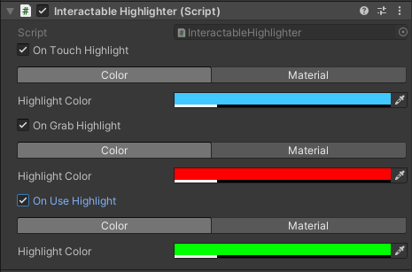](../images/default-behaviors/interactable-highlighter-script.png)

You can define the Color and Material for *On Touch Highlight*, *On Grab Highlight*, and *On Use Highlight*. The object will show the highlight color configured in the Highlight behavior by default. As soon as the object is touched it will change to the color configured in *On Touch Highlight*. The same happens when the object is grabbed or used. It will display the configured color in ‘On Grab Highlight’ or ‘On Use Highlight’. 

### Configuration

- **Color**

    Color in which the target object will be highlighted. Colors are defined in the RGBA or HSV color channel. By configuring the alpha (A) value, highlights can be translucent.

- **Object**

    The `Process Scene Object` which should be highlighted.

------

## Guidance/Audio Hint

### Description

This composite behavior plays an audio file after a set time, for example to give the user some delayed hints.

### Configuration

The Audio Hint behavior is a sequence combining a Delay and a Play Audio File behavior. Please refer to the documentation for the [Behavior Sequence](#utilitybehavior-sequence), the [Delay behavior](#utilitydelay) and the [Play Audio File behavior](#guidanceplay-audio-file).

------

## Guidance/Spawn Confetti

### Description

The Spawn Confetti behavior causes confetti to fall above the selected `Object`. It can be useful as visual feedback or celebration for completing a task successfully.

### Configuration

- **Spawn Above User**

    If checked, the spawn position will be above the user rather than on the specified `Process Scene Object`.

- **Position Provider**

    Specifies where the confetti should spawn if not set to spawn above the user.

- **Confetti Machine Path**

    Path to the confetti machine prefab, relative to a `Resources` folder. Use the default one or point to your custom confetti machine.

- **Area Radius**

    Radius around the position provider in which confetti will be spawned.

- **Duration**

Duration of the visual effect in seconds.

- **Execution stages**

    By default, steps execute behaviors in the beginning, in their activation stage. This can be changed with the `Execution stages` dropdown menu:

    - `Before Step Execution`: The step invokes the behavior during its activation.
    - `After Step Execution`: Once a transition to another step has been selected and the current step starts deactivating, the behavior is invoked.
    - `Before and After Step Execution`: Execution at activation and deactivation of a step.

------

## Utility/Behavior Sequence

### Description

The Behavior Sequence contains a list of child behaviors which will be activated one after another. A child behavior in the list will not be activated until the previous child behavior has finished its life cycle.

### Configuration

- **Repeat**

    If checked, the behavior sequence restarts from the top of the child behavior list as soon as the life cycle of the last child behavior in the list has finished.

- **Child behaviors**

    List of all queued behaviors. Add behaviors to the list using the *"Add Behavior"* button.

- **Wait for completion**

    If checked, the behavior sequence will finish the life cycle of each child behavior in the list before it transitions to another step. Even when the *"Repeat"* option is enabled, the execution will transition to the next step after the child behavior list has been completed. 
    Uncheck this option if you want to interrupt the sequence as soon as all conditions of a transition are fulfilled.

------

## Utility/Delay

### Description

The Delay behavior completes after the specified amount of time. This step will wait for the duration configured in `Delay (in seconds)`, even when the user fulfills the required conditions to transition to the next step.  

### Configuration

- **Delay (in seconds)**

    Configure the behavior’s delay duration in seconds.

    #### Example

    Delay (in seconds) = 1.3

------

## Utility/Set Parent

### Description

The Set Parent behavior parents an `Object` to another one in the Unity hierarchy.

### Configuration

- **Target**

    The `Process Scene Object` to be parented.

- **Parent**

    The new parent for the target object. Note this can be null, in which case the object will be unparented.

- **Snap to parent transform**

If checked, the target object will snap to the same position and rotation as the parent object.

------

## Environment/Disable Object (by Reference)

### Description

The Disable Object behavior makes the selected `Object` invisible and non-interactive until it specifically is set back to *"enabled"* in a future step.
Put into Unity terms, it deactivates the selected Game Object.

### Configuration

- **Object**

    The `Process Scene Object` to be disabled.

------

## Environment/Enable Object (by Reference)

### Description

The Enable Object behavior makes the selected `Object` visible and interactive until it is specifically set back to *"disabled"* in a future step.
Put into Unity terms, it activates the selected Game Object.

### Configuration

- **Object**

    The `Process Scene Object` to be enabled.

------

## Environment/Disable Object (by Tag)

### Description

The Disable Object behavior makes all objects with the selected `Tag` invisible and non-interactive until specifically set back to *"enabled"* in a future step.
Put into Unity terms, it deactivates all tagged Game Objects.

### Configuration

- **Tag**

    The `Scene Object Tag` to check for.

------

## Environment/Enable Object (by Tag)

### Description

The Enable Object behavior makes  all objects with the selected `Tag` visible and interactive until specifically set back to *"disabled"* in a future step.
Put into Unity terms, it activates all tagged Game Objects.

### Configuration

- **Tag**

    The `Scene Object Tag` to check for.

------

## Environment/Disable Component (by Reference)

### Description

The Disable Component behavior disables all components of a specified type on a given game object. A drop-down list allowing to select the component type will appear once an object is referenced.

### Configuration

- **Object**

    The `Process Scene Object` the component is on.

- **Component type**

    The type of components that will be disabled. 

- **Enable at end of step**

    If checked, the components will be enabled again at the end of the step.

------

## Environment/Enable Component (By Reference)

### Description

The Enable Component behavior enables all components of a specified type on a given game object. A drop-down list allowing to select the component type will appear once an object is referenced.

### Configuration

- **Object**

    The `Process Scene Object` the component is on.

- **Component type**

    The type of components that will be enabled. 

- **Disable at end of step**

    If checked, the components will be disabled again at the end of the step.

------

## Environment/Disable Component (by Tag)

### Description

The Disable Component behavior disables all components of a specified type on all game objects with the given tag.

### Configuration

- **Tag**

    The `Scene Object Tag` to check for.

- **Component type**

    The type of components that will be disabled. 

- **Enable at end of step**

    If checked, the components will be enabled again at the end of the step.

------

## Environment/Enable Component (By Tag)

### Description

The Enable Component behavior enables all components of a specified type on all game objects with the given tag.

### Configuration

- **Tag**

    The `Scene Object Tag` to check for.

- **Component type**

    The type of components that will be enabled. 

- **Disable at end of step**

    If checked, the components will be disabled again at the end of the step.

------

## Environment/Unsnap Object

### Description

The Unsnap Object behavior unsnaps a snapped object from a snap zone. This can be useful in case the object needs to be further manipulated by the process.

### Configuration

Either the object or the snap zone can be left null. This will result in either the object unsnapping from any snap zone it is in, or in the unsnapping of whatever object is snapped to the specified snap zone.

If both are specified, the unsnap will occur only if the specified object is snapped to the specified snap zone.

- **Object to unsnap**

    The `Process Scene Object` to unsnap.

- **Snap zone to unsnap**

    The `Snap Zone` from which the object will be unsnapped.

------

## Animation/Move Object

### Description

The Move Object behavior animates the `Object` to move and rotate (no scaling) to the position and rotation of the `Final Position Provider` in the time specified in the `Duration (in seconds)` parameter.
 
Note: If `Object` was affected by gravity before, it will continue to be affected after this behavior. 

### Configuration

- **Object**

    The `Process Scene Object` to be moved and rotated (no scaling).

- **Final position provider**

    The `Process Scene Object` used as the position provider object. It should be placed at the destination position and rotation.

- **Animation duration (in seconds)**

    Time in seconds the animation takes to move and rotate `Object` to the `Final position provider`.

    #### Example
    
    Duration (in seconds) = 1.3

------

## Default Conditions

Conditions are used to determine which transition is used to exit a step. Transitions are evaluated top to bottom, and the first valid one will be selected. To be valid means to have only fulfilled conditions or no conditions at all.
A condition usually requires the user's intervention, for example grabbing an object. However this is not always the case: conditions like the timeout condition will trigger regardless of the user’s activity. There may also be cases in which other factors in the environment determine if a condition is fulfilled.
Conditions need to be active in order to be fulfilled. As soon as a step is active, all containing Conditions are active as well.

------

## Environment/Move Object in Collider

### Description

The Move Object in Collider  condition is fulfilled when the `Object` is within the specified `Collider` for the required amount of time (`Required seconds inside`) while this condition is active.

### Configuration

- **Object**

    The `Process Scene Object` to move. If the object needs to be grabbed, it needs to have the `Grabbable Property` and a collider component configured. The collider defines the area where the user can grab this object.

- **Collider**

    The `Process Scene Object` with the destination collider. Make sure that a collider is present and that the option `Is Trigger` is enabled.

- **Required seconds inside**

    Set the time in seconds that the `Object` should stay inside the `Collider`.

------

## Environment/Object Nearby

### Description

The Object Nearby condition is fulfilled when the `Object` is within the specified `Range` of a `Reference object`.

### Configuration

- **Object**

    The `Process Scene Object` that should be in the radius of the `Reference Object`. Make sure you add at least the `Process Scene Object` component to this game object in the Unity Inspector. 
    
- **Reference Object**

   The `Process Scene Object` from which you want to measure the distance.

- **Range**

    In this field, you can set the maximum distance between the *Object* and the *Reference object* required to fulfill this condition.

- **Required seconds inside**

    In this field, you can set the time in seconds the `Object` should stay within the radius `Range` of the `Reference Object`.

------

## Interaction/Grab Object (by Reference)

### Description

The Grab Object condition is fulfilled when the user grabs the `Object`. 
The condition is also fulfilled if the user already grabbed the Object before the step was activated, that is, if the user is already holding the specified object.

### Configuration

- **Object**

    The `Process Scene Object` to grab. The object needs to have the `Grabbable Property` and a collider component configured. The collider defines the area where the user can grab this object.

------

## Interaction/Grab Object (by Tag)

### Description

The Grab Object condition is fulfilled when the user grabs any object with the specified `Tag`.
The condition is also fulfilled if the user already grabbed the object before the step was activated, that is, if the user is already holding a valid object.

### Configuration

- **Tag**

    The `Scene Object Tag` that defines the valid objects for this condition. The objects need to have the `Grabbable Property` and a collider component configured. The collider defines the area where the user can grab this object.

------

## Interaction/Release Object

### Description

The Release Object condition is fulfilled when the `Object` is released by the user's controller. If the user is not already holding the specified object in hand while this condition is active, it is fulfilled immediately.

### Configuration

- **Object**

    The `Process Scene Object` to release. The object needs to have the `Grabbable Property` and a collider component configured. 

------

## Interaction/Snap Object (by Reference)

### Description

The Snap Object condition is fulfilled when the `Object` is released into the `Zone to snap into`, which means the collider of the Object and collider of the Zone overlap. Adapt the collider size of the snap zone to increase or decrease the area where the user can release the `Object`. Increasing the collider size of the snap zone decreases the required *snap* precision and simplifies the user's interaction in VR. 
After the user releases the `Object`, this is moved to the snap zone's `SnapPoint`. To adjust this position, change the position of the SnapPoint child object of the `Zone to snap into` object.

#### Snap Zone Generator
For any snappable object you can generate a snap zone that can snap exactly this object and can be used as a `Zone to snap into`. To do so, navigate to the `Snappable Property` in Unity's Inspector and click on the button `Create Snap Zone for this object`. 

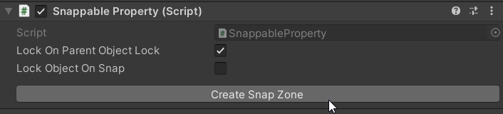

#### Manual Snap Zone Creation
Instead of the automatic generation as described above, you can do those steps also manually. Please refer to available documentation on the `XRSocketInteractor` from Unity or related sources. You can also make changes to the automatically created snap zone to adapt it to your needs. Please note that these changes might impact the process logic.

#### Feed Forward for Snap Zones

Snap zones are restricted to which objects can be snapped. This means every object can be valid (i.e. it can be snapped to this zone) or invalid (it can not be snapped to this zone) for a snap zone. This is achieved with validation components on the snap zone, for example the `Is Object With Tag Validation` component or the `Is Process Scene Object Validation` component. You can use those to configure which specific objects or tags are accepted by the snap zone.
In case you are moving a valid object into a zone, the snap zone color changes to ‘Validation Color’ (green), providing the user in VR with positive feedback. In case you are moving an invalid object into a zone, the snap zone color changes to ‘Invalid Color’ (red), giving the user the feedback that this is the wrong object for this zone. 
You can modify the colors and materials to be used in the Snap Zones parameters and settings.

#### Snap Zone Parameters and Settings
To change the highlight color or validation hover material of a dedicated snap zone, navigate to the snap zone object in the Unity Inspector. You will find the Snap Zone Parameters and Settings in the script `Snap Zone`.

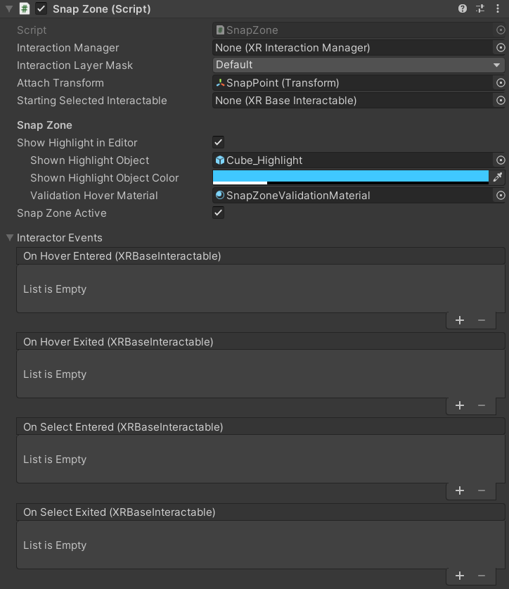

To change the colors and materials of all snap zones in the scene, select them in the VR Builder snap zone settings and press 'Apply settings in current scene'.

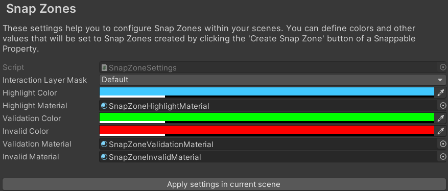]

The snap zone settings can be found in the project settings in tab `VR Builder > Settings > Snap Zones`.

### Configuration

- **Object**

    The `Process Scene Object` to place (snap). The object needs to have the `Snappable Property` and a collider component configured. 

- **Zone to snap into**

    This field contains the `Process Scene Object` where the `Object` is required to be snapped. Make sure you added the `Snap Zone Property` component to the snap zone game object in the Unity Inspector. Besides, the object must have a collider component with the `Is Trigger` property *enabled*.
    
    ------

## Interaction/Snap Object (by Tag)

### Description

This condition is fulfilled when any object with the specified tag is released into the `Zone to snap into`, which means the collider of the Object and collider of the Zone overlap. Adapt the collider size of the snap zone to increase or decrease the area where the user can release the `Object`. Increasing the collider size of the snap zone decreases the required *snap* precision and simplifies the user's interaction in VR. 
After the user releases the object, this is moved to the snap zone's `SnapPoint`. To adjust this position, change the position of the SnapPoint child object of the `Zone to snap into` object.

#### Snap Zone Generator
For any snappable object you can generate a snap zone that can snap all objects with its same tags and can be used as a `Zone to snap into`. To do so, navigate to the `Snappable Property` in Unity's Inspector and click on the button `Create Snap Zone for objects with the same tags`. 

#### Manual Snap Zone Creation
Instead of the automatic generation as described above, you can do those steps also manually. Please refer to available documentation on the `XRSocketInteractor` from Unity or related sources. You can also make changes to the automatically created snap zone to adapt it to your needs. Please note that these changes might impact the process logic.

#### Feed Forward for Snap Zones

Snap zones are restricted to which objects can be snapped. This means every object can be valid (i.e. it can be snapped to this zone) or invalid (it can not be snapped to this zone) for a snap zone. This is achieved with validation components on the snap zone, for example the `Is Object With Tag Validation` component or the `Is Process Scene Object Validation` component. You can use those to configure which specific objects or tags are accepted by the snap zone.
In case you are moving a valid object into a zone, the snap zone color changes to ‘Validation Color’ (green), providing the user in VR with positive feedback. In case you are moving an invalid object into a zone, the snap zone color changes to ‘Invalid Color’ (red), giving the user the feedback that this is the wrong object for this zone. 
You can modify the colors and materials to be used in the Snap Zones parameters and settings.

#### Snap Zone Parameters and Settings
To change the highlight color or validation hover material of a dedicated snap zone, navigate to the snap zone object in the Unity Inspector. You will find the Snap Zone Parameters and Settings in the script `Snap Zone`.

To change the colors and materials of all snap zones in the scene, select them in the VR Builder snap zone settings and press 'Apply settings in current scene'.

]

The snap zone settings can be found in the project settings in tab `VR Builder > Settings > Snap Zones`.

### Configuration

- **Object**

    The `Process Scene Object` to place (snap). The object needs to have the `Snappable Property` and a collider component configured. 

- **Zone to snap into**

    This field contains the `Process Scene Object` where the `Object` is required to be snapped. Make sure you added the `Snap Zone Property` component to the snap zone game object in the Unity Inspector. Besides, the object must have a collider component with the `Is Trigger` property *enabled*.

------

## Interaction/Touch Object

### Description

The Touch Object condition is fulfilled when the `Object` is touched by the user's controller.  If a user is already touching the specified object while this condition is active, this condition is fulfilled immediately.

### Configuration

- **Object**

    The `Process Scene Object` to be touched. The object needs to have the `Touchable Property` and a collider component configured. 

------

## Interaction/Use Object

### Description

The Use Object condition is fulfilled when the `Object` is used by pressing the *Use* button of the controller while being touched or grabbed.

### Configuration

- **Object**

    The `Process Scene Object` that is required to be used.The `Object` needs to have the `Usable Property` and a collider component configured.

------

## Utility/Timeout

### Description

The Timeout condition is fulfilled when the time specified in `Wait (in seconds)` has elapsed. This can make sense as a "fallback" condition. For example, if the user does not complete condition X in the allotted amount of time, the timeout condition will trigger leading to a different step with different consequences.

### Configuration

- **Wait (in seconds)**

    Set the time in seconds that should elapse before this condition is fulfilled.

------

## VR User/Teleport

### Description

The Teleport condition is fulfilled when the user teleports to the referenced `Teleportation Point`. Previous teleportation actions made into the `Teleportation Point` are not considered.

The provided `Teleportation Property` is based on the Unity XR Interaction Toolkit's `Teleportation Anchor`. For further reference, please check out the XR Interaction Toolkit  [documentation](https://docs.unity3d.com/Packages/com.unity.xr.interaction.toolkit@2.0/api/UnityEngine.XR.Interaction.Toolkit.TeleportationProvider.html).

#### Configuring the Teleportation Point

The `Teleportation Property` can be set as a **Default Teleportation Anchor** by clicking on the `Set Default Teleportation Anchor` button. You can find it when selecting the `Teleportation Point` and viewing it in the Unity Inspector.

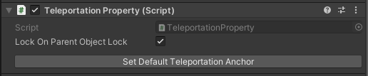

This will configure the attached `Teleportation Anchor`. It will provide a visual element in the Unity Editor that helps placing the `Teleportation Point` in the scene. This visual element will also be shown in the virtual world during training execution to guide the user.

### Configuration

- **Teleportation Point**

    The `Teleportation Property` where the user should teleport.

## Online Documentation

We offer a constantly expanding list of [guides and tutorials](https://www.mindport.co/tutorials-unity-vr-development) on our website. We encourage you to check them out to improve your VR Builder skills.

If this is your first time with VR Builder, you should start from the [Process Editor](https://www.mindport.co/vr-builder-learning-path/how-to-define-the-process-of-vr-applications-in-unity) and [Step Inspector](https://www.mindport.co/vr-builder-learning-path/how-to-define-steps-of-vr-applications-in-unity) tutorials, which explain the basics of working with VR Builder.

In addition,you might also want to check out the guides on how to build standalone VR Builder apps on the [Oculus Quest](https://www.mindport.co/vr-builder-learning-path/how-to-run-vr-builder-apps-on-oculus-quest-devices) or [Pico Neo 3](https://www.mindport.co/vr-builder-learning-path/how-to-run-vr-builder-apps-on-pico-neo-devices).

You can also check out some guides on the more advanced interactions, like the [series on snap zones](https://www.mindport.co/vr-builder-learning-path/pick-and-place-introduction-to-snap-zones).

Lastly, there are some [step-by-step tutorials](https://www.mindport.co/vr-builder-learning-path/how-to-create-a-vr-ball-game-with-track-and-measure-add-on-for-vr-builder) explaining how to work with our latest paid add-ons. Even if you don't intend to buy the relevant content, they can provide a good overview on how to build a functional process with VR Builder from scratch. 

## Acknowledgements

VR Builder is based on the open source edition of the [Innoactive Creator](https://www.innoactive.io/creator). While Innoactive helps enterprises to scale VR training, we adopted this tool to provide value for smaller content creators looking to streamline their VR development processes. 

Like Innoactive, we believe in the value of open source and will continue to support this approach together with them and the open source community.

## Contact and Support

Join our official [Discord server](http://community.mindport.co) for quick support from the developer and fellow users. Suggest and vote on new ideas to influence the future of the VR Builder.

Make sure to review VR Builder on the [Unity Asset Store](https://assetstore.unity.com/packages/tools/visual-scripting/vr-builder-201913) if you like it. This will help us sustain the development of VR Builder.

If you have any issues, please contact [contact@mindport.co](mailto:contact@mindport.co). We'd love to get your feedback, both positive and constructive. By sharing your feedback you help us improve - thank you in advance!
Let's build something extraordinary!

You can also visit our website at [mindport.co](http://www.mindport.co).
