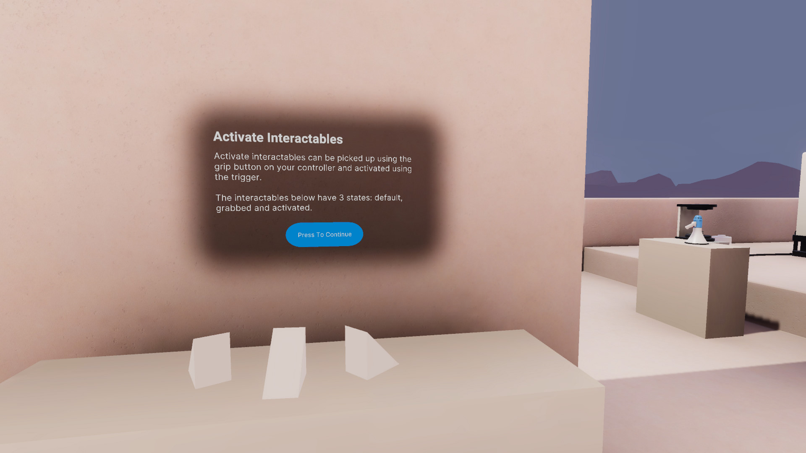
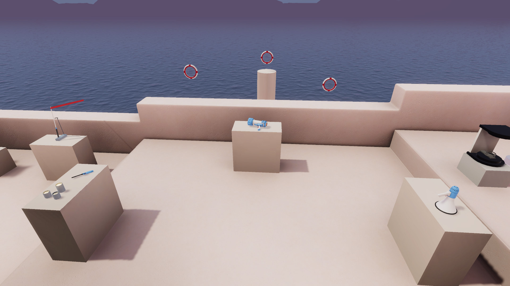

# Activate Interactables

## Station descriptor

Activate interactables can be picked up using the grip button on your controller and activated using the trigger.

The interactables below have 3 states: default, grabbed and activated.

## Basic example

The basic example objects differ from the [Grab Interactables](GrabInteractables.md) station in that they respond to the controller trigger when they are held. This occurs through their **HoverStateVisual** configuration, which is a child Prefab of the interactable. These objects are set to pulse a color when the controller trigger is pressed.

## Advanced examples

The advanced examples demonstrate three different uses for activate interactables. Each of these use the **Activate** interactable events in the **XR Grab Interactable**. You can look at how they are set up in the Inspector window to see how to set up your own interactions.

These advanced objects are also set up to automatically animate the triggers as the user presses the trigger on their controllers. This occurs through the **Interaction Animator** script, which will drive a timeline that contains a trigger animation.

The **Prefer Grab Interaction** script causes these objects to warp to a user's hand when grabbed, rather than starting at the distance the ray hit the object at.

