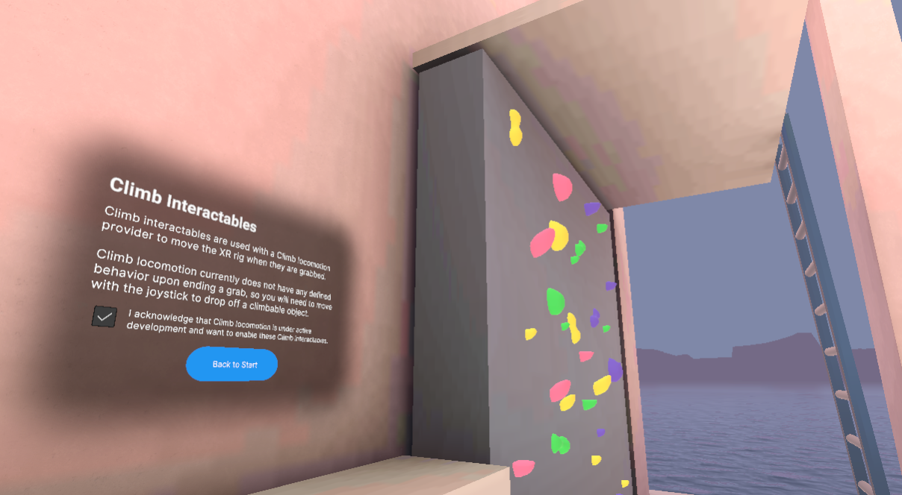

# Climb Interactables

## Station descriptor

Climb interactables are used with a Climb locomotion provider to move the XR rig when they are grabbed.

Climb locomotion currently does not have any defined behavior upon ending a grab, so you will need to move with the joystick to drop off a climbable object.

## Overview

This station has examples of Climb interactables that facilitate Climb locomotion while they are grabbed. The ladder is constrained to only allow movement along its y-axis (and its z-axis at the top) and leads to a teleport area. The wall has distinct Climb interactables for each colored route, each allowing for movement in any direction.

Currently the Climb interactables in this station are disabled by default because you are not able to drop off them without manually using continuous locomotion or teleportation. There is a toggle in the station UI to enable the interactables.
