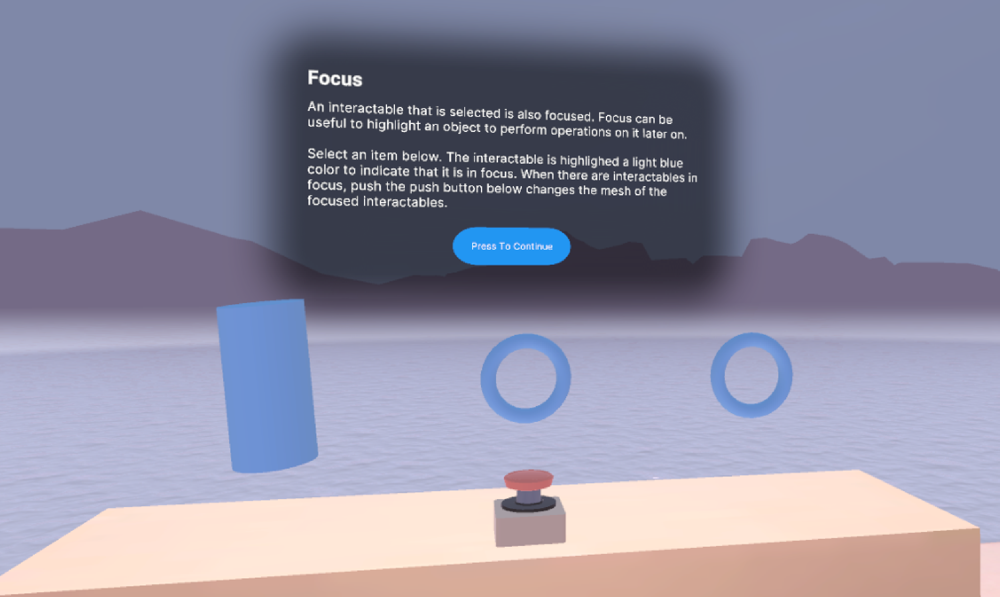

# Focus Interaction

## Station descriptor

Interactables are considered focused when they are selected by an Interactor. An Interactable's `Focus Mode` defines the focus policy of that Interactable. `Single` allows the Interactable to only be focused by a single Interaction group at a time and allows other Interaction groups to take focus by automatically losing focus. `Multiple` allows for multiple Interaction groups at a time to focus the Interactable. `None` means that focus is not supported this Interactable.

Focus can be useful when trying perform actions on Interactables, for example, changing the color of focused Interactables from a menu.

## Basic examples

The Interactables at this station will highlight light blue when they are in focus. When the push button at this station is pressed, the Interactables in focus at this station will shuffle through various meshes.
