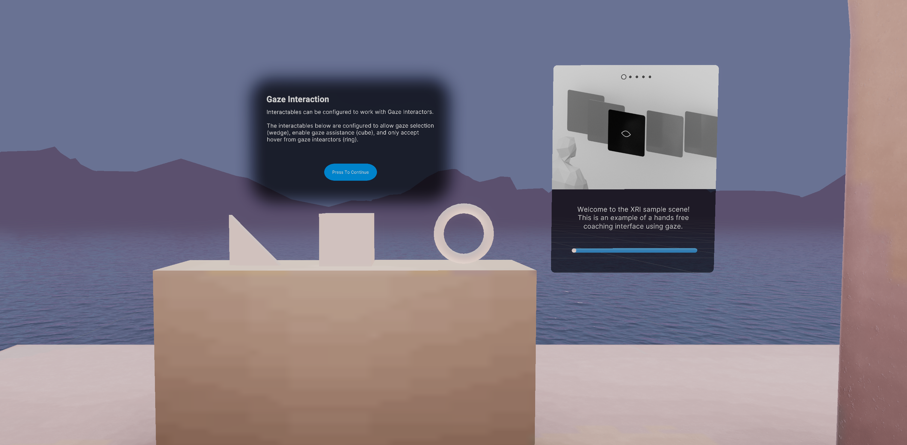

# Gaze Interaction

## Station descriptor

Gaze Interactors' position and rotation are driven by the user's tracked eye pose. They can be used to hover and select as well as help facilitate other interactors' actions.  Additionally, each interactable can be configured with gaze settings on an individual interactable level. If eye tracking is not available, gaze can fallback to head tracking to support the desired gaze features.

## Basic examples

Gaze Interactors can hover, select, and deselect interactables configured to accept gaze interaction. The gaze interactor in this project is configured to hover to select after a certain dwell time, and auto deselect after an additional period of time. The wedge is a Simple Interactable configured to accept gaze selection and then will automatically be deselected.

The cube at this station is a grab interactable configured to enable gaze assistance. When a gaze interactor hovers an interactable with gaze assistance enabled, the gaze interactor will place a snap volume around the interactable. This snap volume will create a largers area for ray interactors to snap to and interact with this interactable.

The ring is a simple interactable that utilizes interaction layers to only allow interaction from the gaze interactor.

To the right of the station, the coaching cards explain some basics of utilizing gaze interaction. Dwelling on the cards with the gaze interactor will progress the cards.
