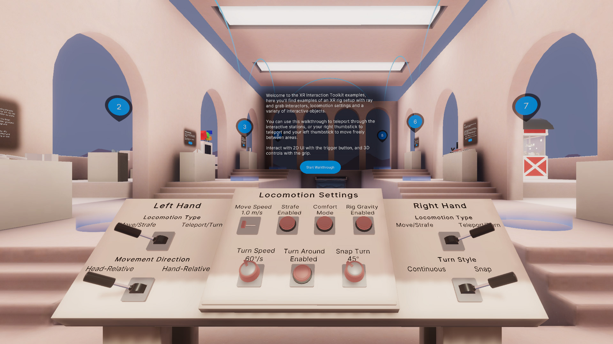

# Locomotion Setup

## Station descriptor

Welcome to the XR Interaction Toolkit examples. Here you'll find examples of an XR Origin setup with ray and grab interactors, locomotion settings, and a variety of interactive objects.

You can use this walkthrough to teleport through the interactive stations, or your thumbsticks to teleport or move freely between areas.

## Default locomotion

Locomotion starts configured for continuous movement and strafing on the left hand and teleportation and snap turning for the right hand; these defaults are used most commonly in VR titles. Instant locomotion is also the most comfortable for most users. Smooth transitions can make some users uncomfortable, so additional options are presented as toggles at the locomotion settings table.

Each hand can have its own unique locomotion setup (or identical if preferred). The specific runtime customization options are detailed below.

## Runtime customization

The center console of the table contains configuration options.
* **Move Speed** - How quickly the user moves when using continuous motion
* **Strafe Enabled** - Sideways movement when using the left or right thumbstick or touchpad
* **Comfort Mode** - Turns on and off comfort mode tunneling (vignette effect)
* **Rig Gravity Enabled** - When the player walks over a ledge (either with locomotion or their actual body), this will cause the user rig to reposition itself to be at the new ground level.
* **Turn Speed** - How quickly (in degrees per second) to smoothly turn the user rig.
* **Turnaround Enabled** - If pressing **back** on the thumbstick or touchpad will cause the user to turn around instantly.
* **Snap Turn** - Increment (in degrees) for **instant** side-turning.

Each side of the table corresponds to a specific configuration for each hand.
* **Locomotion Type** - Type of locomotion the thumbstick or touchpad will be bound to.
   * **Move/Strafe** - This will move the user smoothly forward and back and side to side.
   * **Teleport/Turn** - This will allow the user to teleport by pressing **up** with the thumbstick or touchpad and aiming where they wish to go. Pressing side to side will turn the user based on the **`Turn Style`** configured.
* **Movement Direction** - This toggle becomes active when `Move/Strafe` is enabled for the controller.
   * **Head-Relative** - Moves the player rig based on the direction the player is looking.
   * **Hand-Relative** - Moves the player rig based on the direction they are pointing their controller.
* **Turn Style** - This toggle becomes active with `Teleport/Turn` is enabled for the controller.
   * **Continuous** - Tells the locomotion system to smoothly turn the player side to side by the `Turn Speed`.
   * **Snap** - Tells the locomotion system to turn the player rig by the `Snap Turn` amount configured on the center console.
