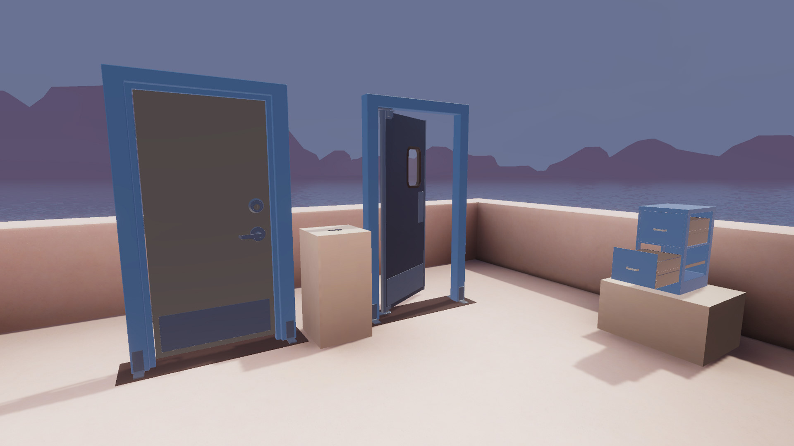

# Physics Interactables

## Station descriptor

Physics interactables can be grabbed and manipulated using the Collider or grip on your controller.

The interactables shown here build on basic grab interactables by adding physics joint components to enable swinging, springing, and sliding interactions.

## Overview

Using XR and Physics together is a significant, but worthwhile challenge. These are the interactions that will make your XR world come alive and react in ways that users expect, but each system operates in an opposite manner.

Physics works most smoothly when everything is simulated, and objects move through applied forces. The physics solver is able to determine how everything should move in a physically simulated way.

XR, on the other hand, wants to force objects to match their positions in the real world. This results in the low latency, accurate interactions that feel great to XR users.

However, attempting to force positions of physics objects can often result in extreme or unrealistic forces being exerted. The simplest example is that users are able to essentially exert unlimited force to push objects. This gets even trickier when introducing physics joints, as they often react quite violently to their positions or rotations being set rather than influenced.

## Basic example

The XRI samples provide powerful tools for making XR and physics coexist smoothly. The simple example demonstrates using **XR Grab Interactables** with default **physics joints**.

The important configurations elements are that **physics joints** have preprocessing disabled - this prevents the extreme reactions from occurring. The **XR Grab Interactables** are set to use the **Velocity Tracking** movement type, which does not force a physics position but rather sets the objects speed to match where the user's XR devices are positioned. This can still exert high-force on other physics objects, but will result in objects that collide with the world and can be stopped by static geometry.

## Advanced examples

The advanced examples make use of a custom **physics joint** called the **Transform Joint**. This joint combines the best of both worlds for low-latency interactions combined with realistic values for exerting force.

The **transform joint** will cause a Rigidbody to follow a transform. If there are no obstructions this occurs instantly, and in scenarios where there are other physics objects in the way, the **transform joint** will exert more force the further the offset. If a user pushes on an object, the harder they push, the more force is exerted.

A **transform joint** is located on each hand in the **XR Origin**, in the **Pusher** GameObject. This is used with the Door advanced examples. The pusher follows the hand, and when the door obstructs the path, the more the user pushes (or locomotes), the more force is used to push open the door.

The second door uses a combination of many features of XRI and the samples. The key is a **grab interactable**, and the lock is a **socket**. When the key is placed, this object turns into an **XR Knob** to enable the user to rotate the key in either direction to lock or unlock the door. The handle is also an *XR Knob*. When it is rotated enough, the handle activates another **transform joint** that makes the door handle move towards the interactable. This allows the user to pull open or close the door.

Lastly, the filing cabinet demonstrates using a **configurable joint** to create **XR Grab Interactables** that move along a specific axis.